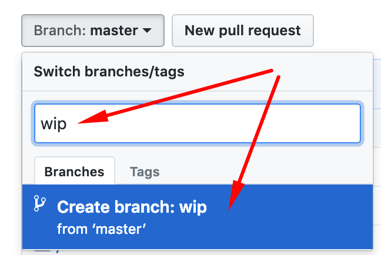
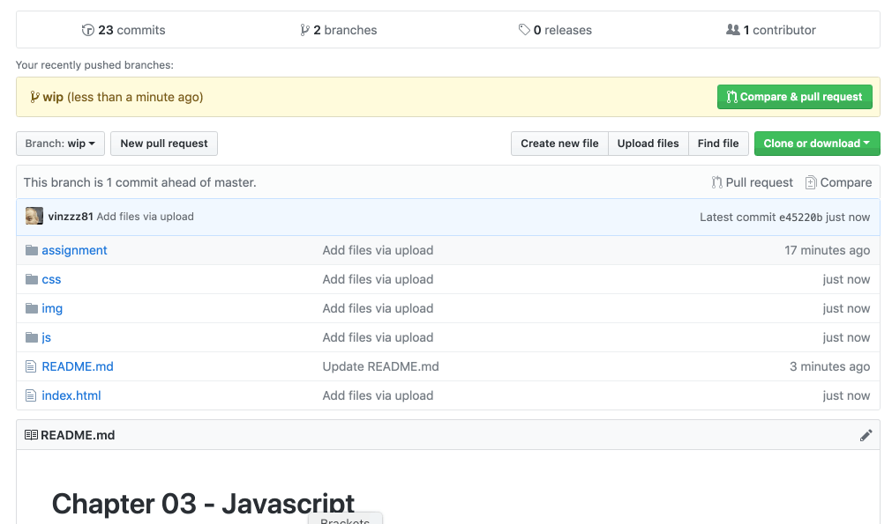

# Chapter 03 - Javascript

*PLEASE READ THIS **ENTIRE** DOCUMENT FIRST*

* [assignment-14-using-data](#assignment-14-using-data)
* [submitting-your-work](#submitting-your-work)


## Assignment 14: Using data

Download this repo to your local machine and edit the files. 


Use the following formulae to convert longitude and latitude numbers to x and y coördinates in an SVG.
```
let positionX = (~~longitude + 180)*2;
let positionY = (90-~~latitude)*2;
```
Generate an SVG, dimensions 640x360 pixels and use the longitude and latitude data from all cities to draw little circles on those spots. Use a ```for(){}``` loop to iterate over every city.
You have to declare and initiate the longitude and latitude variables yourself.

### Tip:

We used a simple array of numbers in class, like this:
```
let arrayNumbers = [3,5,6];
//to show number 6 in the console:
console.log(arrayNumbers[2]);
```

The variable cities (already included in cities.js) is an array of objects, not an array of numbers.
```
let cities = [{
    "name": "Shanghai",
    "latitude": 31.22222,
    "longitude": 121.45806,
    "population": 22315474
  },
  {
    "name": "Buenos Aires",
    "latitude": -34.61315,
    "longitude": -58.37723,
    "population": 13076300
  },
  {
    "name": "Mumbai",
    "latitude": 19.07283,
    "longitude": 72.88261,
    "population": 12691836
  }];
//to show the city Mumbai in the console:
console.log(cities[2].name);
```
Iterating over an array is easy:
```
let arrayNumbers = [3,5,6];
for(let i=0;i<arrayNumbers.length;i++){
    console.log("this is number: " + arrayNumbers[i]);
}
```

## Submitting your work
Create a new branch called **wip** and upload your work into this branch, **not** in the master branch:



To 'submit' your work, click the **new pull request** button. 
  * Choose **base:master** and **compare:wip**. 
  * Select **vincentsijben** as a reviewer (in the sidepanel on the right)
  * Be sure to put a descriptive message in the comment section.
  
  
